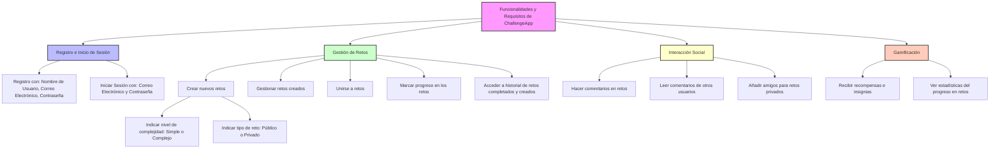

# ChallengeApp

## LOGO

## Integrantes

- Alfredo Mituy Okenve Obiang
- José Luis Obiang Ela Nanguang

## Eslogan

Supera tus retos, alcanza nuevas metas

## Resumen

La aplicación web permite a los usuarios crear, unirse y seguir su progreso en retos de hábitos comunitarios, como ejercicio y lectura. Fomenta la motivación y la constancia a través de la competencia amistosa y el apoyo social.

## Descripción

El objetivo de esta aplicación web es proporcionar una plataforma donde los usuarios puedan crear, unirse y seguir su progreso en retos de hábitos comunitarios. Cada usuario puede participar en diferentes desafíos personales (ejercicio, lectura, meditación, etc.), ver su progreso y el de otros usuarios, y compartir sus avances dentro de una comunidad de soporte. La idea es fomentar la motivación y la constancia a través de la competencia amistosa y la colaboración social.

### Funcionalidades, Requisitos, “Pliego de condiciones”...

- El usuario debe poder registrarse e iniciar sesión en la App
  - El usuario introducirá un nombre de usuario, el correo electrónico y una contraseña.
- El usuario debe poder crear nuevos retos y gestionarlos
  - El usuario indicará el tipo de reto según el nivel de complejidad (simple o complejo: con subtareas)
  - El usuario indicará el tipo de reto (privado, público).
- El usuario debe poder unirse a distintos retos e ir marcando su progreso en los mismos
- El usuario debe poder hacer comentarios y leer los de otros usuarios
- El usuario debe poder acceder al historial de retos que ha completado y también de los que ha creado.
- El usuario podrá recibir recompensas e insignias de los retos que vaya completando.
- El usuario debe poder añadir amigos a los que retar con retos privados
- El usuario podrá ver una estadística del progreso de todos sus retos.

### Funcionalidades opcionales, recomendables o futuribles

- El usuario podrá filtrar retos según la ubicación del usuario, el tipo de reto, nombre, etc.
- El usuario podrá cambiar el color de fondo de la página web (oscuro, claro).
- El usuario podrá elegir el idioma de la página web.
- El usuario podrá recibir notificaciones sobre su progreso y las medallas o recompensas que vaya obteniendo.

# Enlaces de Gemini

[Gemini(Markdown & Github)](https://g.co/gemini/share/018e821a2eb5)
