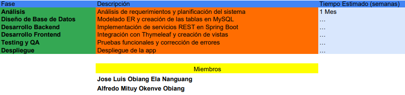
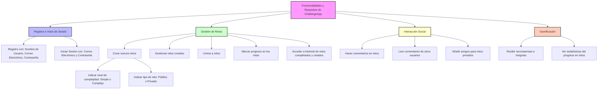

# ChallengeApp


## Integrantes

- Alfredo Mituy Okenve Obiang
- José Luis Obiang Ela Nanguang
## Profesor
- Luis Vicente Calderita Estévez 

## Eslogan

```markdown
> [!IMPORTANT]
> Supera tus retos, alcanza nuevas metas
```

## 1. Planificación del Proyecto
### Objetivo del Proyecto
El objetivo de la aplicación es permitir a los usuarios crear, gestionar y participar en retos (simples o complejos) para alcanzar objetivos personales. Los retos pueden ser completados de forma individual o en grupo, y la aplicación ofrece recompensas por el progreso, estadísticas, comentarios y notificaciones. Los usuarios también podrán interactuar con amigos y compartir sus logros.

> [!TIP]  
> **Tecnologías Utilizadas:**  
    > - Backend: Spring Boot (Java)  
    > - Base de Datos: H2 para producción, MySQL para producción   
    > - Frontend: Thymeleaf   
    > - Control de Versiones: Git   
    > - Servidor: Tomcat embebido en Spring Boot   
    > - Java: 17 LTS     

> [!WARNING]
> **Módulos del Proyecto:**
> 1.	Gestión de Usuarios: Registro, login, perfil, amigos.
> 2.	Gestión de Retos: Crear retos, gestionar subtareas, seguimiento de progreso.
> 3.	Estadísticas y Recompensas: Visualización del progreso y estadísticas, obtención de recompensas.
> 4.	Comentarios y Notificaciones: Comentarios en retos y notificaciones sobre el progreso.
> 5.	Sistema de Amigos: Agregar amigos, ver su progreso y participar en retos juntos.  

> [!NOTE]  
> **Cronograma Actual:**  
> 


## 2. Análisis del Proyecto
### Requerimientos Funcionales
> [!IMPORTANT]
> - Registro y Login: El sistema debe permitir a los usuarios registrarse, iniciar sesión y gestionar su perfil.
> - Creación de Retos: Los usuarios pueden crear retos simples o complejos.
> - Seguimiento de Progreso: Los usuarios pueden actualizar el progreso de los retos, tanto en retos simples como en retos complejos con subtareas.
> - Comentarios y Notificaciones: Los usuarios pueden comentar en retos y recibir notificaciones sobre su progreso y actividades de amigos.
> - Estadísticas y Recompensas: El sistema debe mostrar estadísticas personales y ofrecer recompensas en función del progreso en los retos.  

### Requerimientos No Funcionales
> [!TIP]
> - Seguridad: Implementar validación de usuarios y seguridad de las sesiones (Spring Security).
> - El usuario podrá filtrar retos según la ubicación del usuario, el tipo de reto, nombre, etc.
> - El usuario podrá cambiar el color de fondo de la página web (oscuro, claro).
> - El usuario podrá elegir el idioma de la página web.
> - El usuario podrá recibir notificaciones sobre su progreso y las medallas o recompensas que vaya obteniendo  

### Casos de Uso Detallados
**1. Caso de Uso CU01: Registro de Usuario**
- ID: CU01
- Nombre: Registro de Usuario
- Actor Principal: Usuario
- Descripción: Permite a un usuario registrarse en la plataforma proporcionando los datos requeridos.
- Precondiciones:
  - El usuario debe acceder al sistema sin haber iniciado sesión.
- Flujo Principal:
  - El usuario accede a la página de registro.
  - El sistema presenta un formulario de registro con los campos: nombre, correo, contraseña, ubicación.
  - El usuario llena el formulario y lo envía.
  - El sistema valida que los campos no estén vacíos y que el correo no esté en uso.
  - El sistema registra al usuario y guarda los datos en la base de datos.
  - El sistema confirma la creación del perfil con un mensaje y redirige al inicio de sesión.
    
- Postcondiciones:
    - El usuario se registra en el sistema.
- Excepciones:
  - El correo ya está registrado: El sistema muestra un mensaje de error. 
  - Datos inválidos o incompletos: El sistema muestra un mensaje de error.
________________________________________  

**2. Caso de Uso CU02: Inicio de Sesión**
- ID: CU02
- Nombre: Inicio de Sesión
- Actor Principal: Usuario
- Descripción: Permite a un usuario registrado iniciar sesión proporcionando su correo y contraseña.
- Precondiciones:
  - El usuario debe estar registrado en el sistema.
- Flujo Principal:
  - El usuario accede a la página de inicio de sesión.
  - El sistema presenta un formulario de inicio de sesión.
  - El usuario ingresa su correo y contraseña y envía el formulario.
  - El sistema valida las credenciales ingresadas.
  - Si las credenciales son correctas, el sistema redirige al panel principal del usuario.
- Postcondiciones:
    - El usuario está autenticado y tiene acceso a su perfil y a todas las funcionalidades asociadas.
- Excepciones:
    - Credenciales incorrectas: El sistema muestra un mensaje de error.
    - Usuario no registrado: El sistema muestra un mensaje de error.
________________________________________  
**3. Caso de Uso CU03: Crear Reto Simple**
- ID: CU03
- Nombre: Crear Reto Simple
- Actor Principal: Usuario
- Descripción: El usuario puede crear un reto simple proporcionando los datos necesarios.
- Precondiciones:
  - El usuario debe haber iniciado sesión.
- Flujo Principal:
  - El usuario selecciona la opción "Crear Reto".
  - El sistema muestra un formulario con campos como nombre, descripción, duración, y tipo de reto.
  - El usuario elige "Reto Simple", completa el formulario e ingresa los datos de progreso en formato de subtareas o cantidades (por ejemplo, "Leer 5 libros").
  - El usuario confirma la creación del reto.
  - El sistema guarda el reto simple en la base de datos y muestra un mensaje de confirmación.
- Postcondiciones:
  - El reto se guarda y aparece en la lista de retos activos del usuario.
- Excepciones:
  - El usuario no está autenticado: El sistema redirige al inicio de sesión.
  - Datos inválidos: El sistema muestra un mensaje de error.
________________________________________  

**4. Caso de Uso CU04: Crear Reto Complejo**
- ID: CU04
- Nombre: Crear Reto Complejo
- Actor Principal: Usuario
- Descripción: El usuario puede crear un reto complejo que contiene una lista de subtareas.
- Precondiciones:
  - El usuario debe haber iniciado sesión.
- Flujo Principal:
  - El usuario selecciona "Crear Reto".
  - El sistema presenta un formulario con los campos para ingresar el nombre, descripción, duración y tipo de reto.
  - El usuario selecciona "Reto Complejo", e ingresa las subtareas del reto.
  - El usuario define cada subtarea con su nombre, descripción, y fecha de creación.
  - El usuario confirma la creación del reto complejo.
  - El sistema guarda el reto complejo y las subtareas asociadas en la base de datos.
- Postcondiciones:
 - El reto complejo se guarda y aparece en la lista de retos activos del usuario.
- Excepciones:
 - Datos incompletos o inválidos: El sistema muestra un mensaje de error.
 
**5. Caso de Uso CU05: Anotar Progreso en Reto Simple**
- ID: CU05
- Nombre: Anotar Progreso en Reto Simple
- Actor Principal: Usuario
- Descripción: El usuario puede actualizar su progreso en un reto simple.
- Precondiciones:
 - El usuario debe estar autenticado y tener un reto simple activo.
- Flujo Principal:
- El usuario selecciona el reto simple en el que quiere anotar progreso.
- El sistema muestra el estado actual del progreso.
- El usuario ingresa el nuevo progreso (por ejemplo, aumentar la cantidad de libros leídos).
- El sistema actualiza el progreso en la base de datos.
- El sistema confirma la actualización del progreso y muestra el nuevo porcentaje de completitud.
- Postcondiciones:
  - El progreso del reto simple se actualiza.
- Excepciones:
  - Progreso inválido: El sistema muestra un mensaje de error.
________________________________________  
**6. Caso de Uso CU06: Anotar Progreso en Subtarea de Reto Complejo**
- ID: CU06
- Nombre: Anotar Progreso en Subtarea de Reto Complejo
- Actor Principal: Usuario
- Descripción: El usuario actualiza el estado de una subtarea en un reto complejo.
- Precondiciones:
  - El usuario debe estar autenticado y tener un reto complejo activo.
- Flujo Principal:
  - El usuario selecciona el reto complejo.
  - El sistema muestra la lista de subtareas y su estado actual.
  - El usuario marca una subtarea como completada.
  - El sistema actualiza el estado de la subtarea y recalcula el progreso del reto.
  - El sistema guarda los cambios y muestra el nuevo progreso.
- Postcondiciones:
  - El estado de la subtarea y el progreso del reto complejo se actualizan.
- Excepciones:
  - Error en la actualización de la subtarea: El sistema muestra un mensaje de error.
________________________________________  
**7. Caso de Uso CU07: Agregar Amigos**
- ID: CU07
- Nombre: Agregar Amigos
- Actor Principal: Usuario
- Descripción: Permite a un usuario agregar a otro como amigo en la plataforma.
- Precondiciones:
  - El usuario debe estar autenticado.
- Flujo Principal:
  - El usuario busca a otro usuario por nombre o correo.
  - El sistema muestra una lista de coincidencias.
  - El usuario selecciona "Agregar Amigo".
  - El sistema envía una solicitud de amistad al otro usuario.
  - Cuando el otro usuario acepta, la amistad se registra en el sistema.
- Postcondiciones:
  - Los usuarios quedan conectados como amigos.
- Excepciones:
  - El usuario ya es amigo del destinatario: El sistema muestra un mensaje de advertencia.
________________________________________  
**8. Caso de Uso CU08: Visualizar Estadísticas**
- ID: CU08
- Nombre: Visualizar Estadísticas
- Actor Principal: Usuario
- Descripción: Permite al usuario visualizar sus estadísticas personales sobre los retos.
- Precondiciones:
  - El usuario debe haber participado en retos.
- Flujo Principal:
  - El usuario selecciona "Ver Estadísticas".
  - El sistema muestra las estadísticas del usuario (total de retos, retos completados, progreso promedio, etc.).
  - El usuario puede filtrar las estadísticas por periodo (semanal, mensual, anual).
- Postcondiciones:
  - El sistema muestra las estadísticas personales del usuario.
- Excepciones:
  - No hay retos completados: El sistema muestra un mensaje indicando la falta de datos.
________________________________________  
**9. Caso de Uso CU09: Obtener Recompensas**
- ID: CU09
- Nombre: Obtener Recompensas
- Actor Principal: Usuario
- Descripción: El usuario recibe recompensas por completar retos.
- Precondiciones:
  - El usuario debe haber completado un reto.
- Flujo Principal:
  - El usuario completa un reto.
  - El sistema evalúa si el reto completado es elegible para una recompensa.
  - El sistema otorga una recompensa al usuario (medallas, puntos, etc.).
  - El sistema guarda la recompensa en el perfil del usuario.
- Postcondiciones:
  - El usuario recibe una recompensa que se almacena en su perfil.
- Excepciones:
  - El reto no es elegible para recompensa: El sistema muestra un mensaje explicativo.
________________________________________  
**10. Caso de Uso CU10: Gestión de Notificaciones**
- ID: CU10
- Nombre: Gestión de Notificaciones
- Actor Principal: Usuario
- Descripción: El usuario puede recibir y gestionar notificaciones sobre retos, amigos, y recompensas.
- Precondiciones:
  - El usuario debe haber iniciado sesión.
- Flujo Principal:
  - El sistema envía notificaciones al usuario (nuevos retos, progreso, aceptación de amigos).
  - El usuario accede a su bandeja de notificaciones.
  - El sistema muestra las notificaciones no leídas.
  - El usuario marca las notificaciones como leídas o las elimina.
- Postcondiciones:
  - Las notificaciones son gestionadas correctamente.
- Excepciones:
  - Error en la carga de notificaciones: El sistema muestra un mensaje de error.




